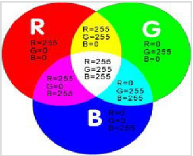
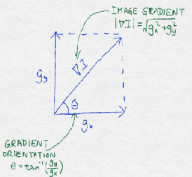
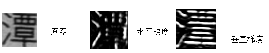
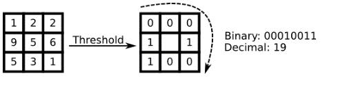
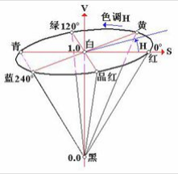
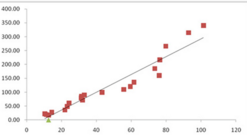

# 识别代码说明 

## 文件说明
| 序号 | 文件名称 | 说明 |
| ------ | ------ | ------ |
| 1 | java| 识别源码目录 |
| 2 | test  | 测试入口 |
| 3 | test/resources | 测试图片【0-9】 |

## 详细介绍
- 图片特征  
  1. RGB色彩模式：是通过对红(R)、绿(G)、蓝(B)三个颜色通道的变化以及它们相互之间的叠加来得到各式各样的颜色的，RGB即是代表红、绿、蓝三个通道的颜色；RGB各有256级亮度，用数字表示为从0、1、2...直到255，0代表黑色，255代表白色
      详见：<strong> java/Feature/RGBFeature.java </strong> 
     
  2. 灰度化: 根据RGB和YUV颜色空间的变化关系可建立亮度Y与R、G、B三个颜色分量的对应：Y=0.3R+0.59G+0.11B，以这个亮度值表达图像的灰度值。
  3. 二值化: 把大于某个临界灰度值的像素灰度设为灰度极大值，把小于这个值的像素灰度设为灰度极小值，从而实现二值化。
          根据阈值选取的不同，二值化的算法分为固定阈值和自适应阈值。 比较常用的二值化方法则有：双峰法、P参数法、迭代法和OTSU法等。 
  4. Hog 图像梯度
     计算图像梯度的最简单的方法是分别计算图像沿水平（X）和垂直（Y）轴的差异，然后将它们合成为二维矢量。
     这涉及两个 1D 差分操作，可以用矢量掩模或滤波器方便地表示。掩码(1, 0, -1)可以得到在左像素和右像素之间的差异或者上像素和下像素之间的差异，取决于我们应用掩码的方向。 
     详见：<strong> java/Feature/HOGFeature.java </strong> 
     
     
  5. LBP（Local Binary Patterns，局部二值模式）
    是提取局部特征作为判别依据的，为一种有效的纹理描述算子，度量和提取图像局部的纹理信息，对光照具有不变性。
    有多种改进型，LBP结合BP神经网络已经用于人脸识别等领域。
    LBP的基本思想是定义于像素的8邻域中, 以中心像素的灰度值为阈值, 将周围8 个像素的值与其比较, 如果周围的像素值小于中心像素的灰度值, 该像素位置就被标记为0, 否则标记为1. 
    每个像素得到一个二进制组合, 就像00010011. 每个像素有8个相邻的像素点,即有2^8种可能性组合。 
    详见：<strong> java/Feature/LBPFeature.java </strong> 
    
  6. HSV
  H：表示色彩信息，即所处的光谱颜色的位置。该参数用一角度量来表示，红、绿、蓝分别相隔120度。互补色分别相差180度。
  S：范围从0到1，它表示成所选颜色的纯度和该颜色最大的纯度之间的比率。S=0时，只有灰度。
  H：表示色彩的明亮程度，范围从0到1。有一点要注意：它和光强度之间并没有直接的联系 
    详见：<strong> java/Feature/HSVFeature.java </strong> 
   

- 图片相似度对比算法  
  1. 直方图匹配 
  在图像识别中，颜色特征是最为常见的。每张图像都可以转化成颜色分布直方图，如果两张图片的直方图很接近，就可以认为它们很相似。这有点类似于判断文本的相似程度
   详见：<strong> java/Compare/DigestCompare.java </strong> 
  2. Xor匹配 
  计算机处理图片并不像人这样可以直观的理解处理，在计算机中的图像可以看成一个矩阵，矩阵中的元素是一个颜色值，这个值由RGB三个参数构成，这三个参数的取值范围为0~255。
  当然图片的表示不只有RGB这一种，其他类型不再详述。由于0~255的范围太大了，我们应该进行图片的降维——二值化。二值化将图片变成只由黑色和白色，可以使用OTSU算法。
  我们再将黑色用1表示，白色用0表示，这样就得到一个矩阵，矩阵中只有数字0和1组成。这个矩阵就是一张图片的特征矩阵。
  将图片放缩归一化到一样大小，之后对于二维的特征矩阵逐行列进行异或运算，计结果为1的个数。
   详见：<strong> java/Compare/XorCompare.java </strong> 
  3. 投影对比
  4. 质心对比
  
  图像识别实例：
  模板为0-9事先学习好的模板在 
    详见：<strong> resource/templetes.txt </strong> 
   通过Xor匹配进行识别，待识别的图像为test/resource/test 目录下的图片
    结果如下： 
     0-uz0acn114v928z8w15B3D_21de75e6-e9.png 0 
     0-uz0acn114v97hjnls0CA2_aec71be7-22.png 0 
     0-uz0acn114v97is0tyDC6C_43c59d6d-92.png 0 
     0.png 0 
     1-uz0acn114v8ygcwpfAB2F_6e62b21-25-c6.png 1 
   ... 
    预测结果和实际结果完全一致 
     详见：<strong>test/java/FeatureCompareTest/doXor </strong> 
   
- logistic回归应用  
  基于Hog，LBP，RGB，HSV特征对比
  线性回归模型对于数据拟合，通过学习多组数据，得出一条可以很好拟合所有数据的方程（模型）。
  再将新数据带入这个方程（模型），就可以计算得出一个数值，即预测结果。 
    
  
  基于Hog特征的logistic回归例子
  用test/resource/0-9 目录下的的图片，提取的hog特征，进行训练，如果是目标字的特征标识为1，否则标识为0.从而得出0-9图片的特征模型。
  用test/resource/test 目录下的图片进行测试，同样提取hog特征，带入训练好的0-9的图片的特征模型进行预测，选取rate最高的结果作为预测结果
  结果如下： 
  0:0.800718690296002 1:0.07358147896497186 2:0.0098628935406146 3:0.019733960104157493 4:0.007271887024329478 5:0.01730323715372181 6:0.021975716557455238 7:0.01777005954012789 8:0.08692908699194778 9:0.059904773402854966 0-uz0acn114v928z8w15B3D_21de75e6-e9.png  ret:0 
  0:0.623457093253387 1:0.020143867157522036 2:0.018123299913996048 3:0.0028609829793147835 4:0.010805607539521063 5:0.023503335284313257 6:0.012029535644953822 7:0.05233051296950161 8:0.02016715443287155 9:0.07416713957129378 0-uz0acn114v97hjnls0CA2_aec71be7-22.png  ret:0 
  0:0.9444144549237126 1:0.045734293197907394 2:0.007151808908728785 3:0.0034447618165752343 4:0.018515277021969014 5:0.010783157345224366 6:0.020353283151009254 7:0.011738535171536302 8:0.01621737781755527 9:0.016689779465503693 0-uz0acn114v97is0tyDC6C_43c59d6d-92.png  ret:0 
  ... 
  预测结果和实际结果完全一致 
  详见：<strong> test/java/FeatureCompareTest/doOcrHog </strong>